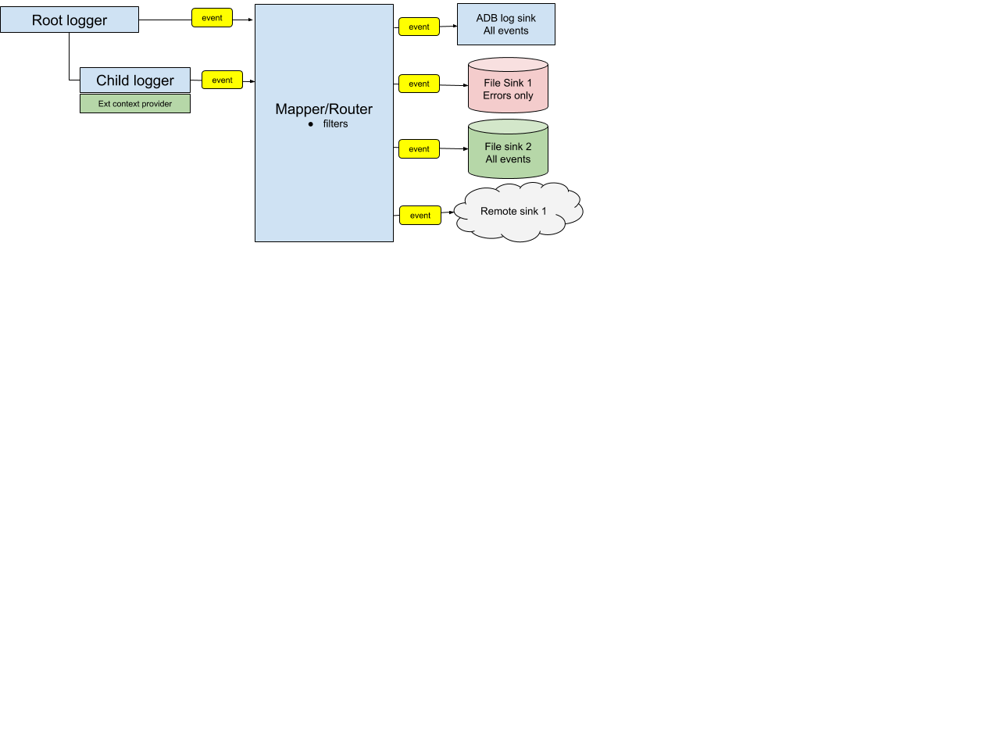

# Universal logger API

* Status: proposed
* Deciders: Aleksandr Smirnov, Anton Kononenko, Alex Zchut, Ran Meirman
* Date: 2020-06-25

Technical Story: issues with diagnostics tooling

## Context and Problem Statement
Right now we do not have any consolidated logging policies and tools.

It leads to a number of issues:
- Many errors are silently ignored even by developers, and lead to obscure effects
- Meaningful information, even if its logged, is not standardized
- QA does not use logging information
- Zapp users can't identify issues without developers help
- We can not diagnose problems on remote systems
- We cant run complex analysis on logging outputs we have now
- Potentially valuable information from logging is not attached to the bug reports

## Decision Drivers

**We do not want to write one more logging library. We want to write an umbrella library with convenient architecture to reuse existing tools and libraries.**

* We want easy and flexible syntax for developers
* We want to be able to use existing embedded and 3rd party logging solutions without changing the logging code: ADB, Apple Logging, Elastic
* We want to be able to provide as much information as possible for every logging output
* We want solution to be open source and not dependent on Applicaster SDKs
* We want solution ot be modular to allow:
  * easy integration of new external logging systems (such as Elastic, MS AppCenter, etc.)
  * easy integration with new platforms (such as ReactNative)
  * easy integration of context providers to enrich the data
* We want to be able to create user-facing UIs to interact with the logging
* We want the system to be easily configurable, both locally by developer, and remotely
  * hierarchy must be present, so we can configure logging output depth for every system
  * route filtering from logging point to every logging output
  * formatters should be interchangeable and configurable
* We want to build on top of the existing logging systems as close as possible

## Considered Options

* [option 1]
* [option 2]
* [option 3]
* ? <!-- numbers of options can vary -->

## Decision Outcome

What our library will do is provide a way to construct structured data in a convenient way.
This is achieved by flexible syntax and context providers.

* EventBuilder is responsible for creating an Event object.
* Logger is a convenient way to configure EventBuidler
* Mapper is a way to route events to sinks, and provide some ahead of time optimizations for event builders (early discard)
* Sink is a way to output the event

Also, we provide a number of default transformation options to collapse this information into limited output formats, like plain text.
This is achieved by providing message and event formatters.

**Logger hierarchy separator is /**
**
## Generic Event format:

* UTC timestamp
* Logging level (verbose, debug, info, warning, error, fatal)
* Full logger name in hierarchy (“applicaster.ui.composite”)
* Tag (optional, will be generated from top of the call stack otherwise)
* Simple text formatted message
* Hierarchical data that can be serialized as JSON, provided by user and context providers:
  * Default context information: thread (with a name), process id
  * Android specific context: application bundle id
  * Custom context information from context provider attached to the log
  * Optional java/JS context information: call stack with source code file name

### Positive Consequences <!-- optional -->

* [e.g., improvement of quality attribute satisfaction, follow-up decisions required, ?]
* ?

### Negative Consequences <!-- optional -->

* [e.g., compromising quality attribute, follow-up decisions required, ?]
* ?

## Pros and Cons of the Options <!-- optional -->

### [option 1]

[example | description | pointer to more information | ?] <!-- optional -->

* Good, because [argument a]
* Good, because [argument b]
* Bad, because [argument c]
* ? <!-- numbers of pros and cons can vary -->

### [option 2]

[example | description | pointer to more information | ?] <!-- optional -->

* Good, because [argument a]
* Good, because [argument b]
* Bad, because [argument c]
* ? <!-- numbers of pros and cons can vary -->

### [option 3]

[example | description | pointer to more information | ?] <!-- optional -->

* Good, because [argument a]
* Good, because [argument b]
* Bad, because [argument c]
* ? <!-- numbers of pros and cons can vary -->

## Links <!-- optional -->

* [Link type] [Link to ADR] <!-- example: Refined by [ADR-0005](0005-example.md) -->
* ? <!-- numbers of links can vary -->
